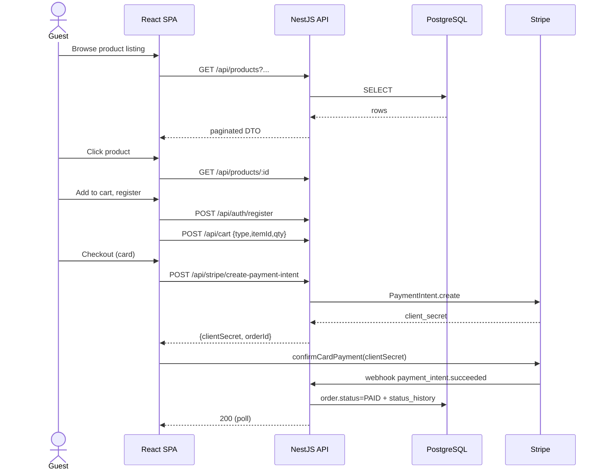

# 02 — Functional Specification

This document describes the **what** of the platform — the user-visible
features, flows, and rules. The **how** lives in [03 HLD](./03-high-level-design.md)
and [04 LLD](./04-low-level-design.md).

## 1. Actors

| Actor | Description |
|---|---|
| Guest | Unauthenticated visitor; can browse, search, view product detail, add to cart locally |
| Customer | Registered shopper (`role = CUSTOMER`) |
| Admin | Back-office user (`role = ADMIN`) — catalog & order operations |
| Super-admin | Full privileges (`role = SUPER_ADMIN`) — settings, user management, deletions |
| System | Background processes: webhook handlers, scheduled jobs |

## 2. Feature catalogue

### 2.1 Catalog (public)

- Browse all products with pagination, search, filters (category, brand,
  designer, price), sort (newest, price-asc/desc, best-seller).
- Product detail with multi-image gallery, full description, highlights,
  specifications, dimensions, packaging, brand & designer.
- **Variants:** swatches per axis (color, size, material). Selecting a swatch
  navigates to the sibling product within the same `productGroupId`. The UI
  hides axes not present on the current product (e.g., when an item has
  exactly one size, only the size button shows; if siblings have other sizes
  they appear too).
- Stock indication (in-stock / low-stock / out-of-stock).
- Sale pricing with strike-through original price + sale badge.
- VAT-inclusive prices everywhere on the storefront. VAT line itemised at
  cart and checkout summaries.

### 2.2 Search & filtering

- Free-text query against `name`, `slug`, `description`, `short_description`.
- Filter facets: `categoryId`, `brandId`, `designerId`, `priceMin`,
  `priceMax`, `inStock`, `onSale`, `isNew`, `isFeatured`, `isBestSeller`.
- Sort options: `newest` (default), `price_asc`, `price_desc`, `popular`.

### 2.3 Account & authentication

- Register with email + password (Argon2 hash). Email-verification token
  emitted (consumed via `/auth/verify-email`).
- Login → returns access token (short-lived JWT) + refresh token (rotated
  in `refresh_tokens` table).
- Refresh: client posts the refresh token to `/auth/refresh`; server rotates
  it and returns a new pair.
- Logout revokes the supplied refresh token.
- Forgot-password → token e-mailed; reset endpoint consumes it.
- Profile: view + update name, phone; manage addresses; manage saved cards.

### 2.4 Favorites

- Customer can favorite/unfavorite a product.
- Listed in the account area; removable individually.
- Guest favoriting is **not** supported — UI redirects to login.

### 2.5 Cart

- One active cart per customer (or guest cart keyed by `guestKey` UUID).
- Items typed by `CartItemType` (currently only `PRODUCT`).
- Quantity update, remove, clear.
- Apply / remove promo code (validated against `promo_codes`).
- Subtotal, discount, VAT, shipping, total computed server-side from
  current product pricing — never trusted from the client.

### 2.6 Checkout

Steps:

1. **Address** — choose existing address or add new (shipping + optional
   billing override).
2. **Shipping** — choose method (`STANDARD` or `EXPRESS`); rate fetched from
   `site_settings`.
3. **Payment** — choose provider:
   - `CREDIT_CARD` → Stripe Payment Intent created server-side; Stripe
     Elements collects card details client-side; webhook confirms paid.
   - `TABBY` → Tabby session created; redirect → return URL → webhook.
   - `TAMARA` → same pattern as Tabby.
   - `CASH_ON_DELIVERY` → order created `PAID = false`, captured on delivery.
4. **Review & place** — order is created with full snapshot fields (VAT
   rate, shipping cost, promo discount, loyalty redemption) so future price
   changes never alter historical orders.

After webhook confirmation, status transitions: `PENDING` → `PAYMENT_PENDING`
→ `PAID` → `PROCESSING` → `SHIPPED` → `DELIVERED`. Each transition writes
an `order_status_history` row.

### 2.7 Loyalty wallet

- Each customer has a singleton `loyalty_wallets` row.
- Earn rule: configurable `spendAedThreshold` → `rewardAed`
  (default: AED 1000 spent → AED 10 reward). Earning happens at order
  `PAID` or `DELIVERED` (configurable).
- Redeem: at checkout, customer picks an AED amount up to current balance
  to apply as discount. Recorded as a `LoyaltyTransaction` of type
  `REDEEMED` linked to the order.
- Adjustments and expiry are admin-driven.

### 2.8 Returns

- Customer requests a return for a delivered order, picking items and a
  `ReturnReason`. Status starts at `REQUESTED`.
- Admin approves → `APPROVED` → customer ships back → `RECEIVED` →
  `COMPLETED` (refund executed via `RefundMethod`: original payment,
  loyalty AED, or store credit) and stock restored.

### 2.9 Bulk-order RFQ (B2B)

- Public form captures contact + line items.
- Stored in `bulk_order_requests` with auto-incrementing `orderNumber`.
- Admin views queue, updates status, adds notes.

### 2.10 Content & merchandising (CMS)

- **Banners** — per `BannerPlacement` (HOME_HERO, HOME_MID, CATEGORY_HERO,
  PRODUCT_BANNER, …) with desktop/mobile media, schedule (`startAt`/`endAt`),
  CTA.
- **Home page** — ordered list of `HomePageSection` rows (HERO, BANNERS,
  CATEGORIES, COLLECTION, BRANDS, NEW_ARRIVALS, BEST_SELLERS, etc.). Each
  has `config` JSON for type-specific options.
- **Landing pages** — slug-keyed pages with sections for marketing
  campaigns.
- **Category landing config** — per-category hero + sections.
- **Navigation** — `navigation_menus` + `navigation_menu_items` with parent
  hierarchy, badges, images.
- **Announcements** — top-bar messages with link, schedule, optional promo
  code.

### 2.11 Settings

- VAT rate (`site_settings` group `vat`).
- Shipping rates per method (group `shipping`).
- Loyalty threshold + reward (`loyalty_page_config`).
- Generic key/value site settings.

### 2.12 Admin operations

| Surface | Capabilities |
|---|---|
| Products | List, create, update, archive (soft-delete), restore, image upload |
| Variants | Group products into a `ProductGroup`, set variant axes & swatches |
| Categories / subcategories / brands / designers | CRUD with sort order |
| Orders | List with filters, view detail, change status, refund, add note |
| Returns | Approve / reject / mark received / complete; restore stock |
| Customers | List, view orders, soft-delete (cascade-safe) |
| Stock | View & post movements (IN, OUT, ADJUSTMENT, RESERVATION, RELEASE) |
| Promos | CRUD promo codes with usage tracking |
| Reports | Sales, revenue, top products, low stock, customer LTV |
| CMS | Banners, home sections, navigation, landing pages, announcements |
| Settings | VAT, shipping, loyalty, generic settings |

### 2.13 Payments

- **Stripe** — `/api/stripe/create-payment-intent` returns the client
  secret; webhook at `/api/stripe/webhook` validates signature and updates
  the order. Idempotent via `stripe_events` table.
- **Tabby** — `/api/tabby/create-session` + `/api/tabby/webhook`.
- **Tamara** — `/api/tamara/create-session` + `/api/tamara/webhook`.
- **COD** — order created in `PAYMENT_PENDING`, transitions on delivery.

## 3. Cross-cutting business rules

- **Price authority:** computed server-side from the current
  `product_pricing` row + sale/override + promo + loyalty + VAT.
- **VAT correctness:** every line stores `unitPriceExclVat`,
  `unitVatAmount`, `unitPriceInclVat`. The order header stores
  `vatRateSnapshot` so reissuing an invoice years later still shows the
  rate that was in effect.
- **Soft delete:** `products.deletedAt` hides the product everywhere except
  in historical order/return records.
- **Concurrency:** stock decrements happen inside a transaction at order
  placement; reservations are tracked in `products.reservedQty`.
- **Idempotency:** payment webhooks dedup via the provider event id
  (`stripe_events.id`).
- **Audit:** order status changes always insert into
  `order_status_history`; stock changes always insert into
  `stock_movements`.

## 4. End-to-end flows

### 4.1 Guest discovery → purchase



### 4.2 Refund & return

```mermaid
sequenceDiagram
  actor C as Customer
  actor A as Admin
  participant API as NestJS API
  C->>API: POST /api/returns {orderId, items, reason}
  API-->>C: REQUESTED
  A->>API: PATCH /api/admin/returns/:id status=APPROVED
  C->>A: Ships goods
  A->>API: PATCH ... status=RECEIVED
  A->>API: POST /api/admin/returns/:id/complete refundMethod=ORIGINAL
  API->>API: stockMovements.IN ; loyalty adjustment if used
  API-->>A: COMPLETED
```

## 5. UI surfaces (storefront pages)

See [07 Frontend Architecture](./07-frontend-architecture.md) for routing.
Key pages:

- `/` Home, `/products`, `/products/:slug`
- `/categories`, `/categories/:slug`, `/brands`, `/brands/:slug`
- `/cart`, `/checkout`, `/payment-callback`
- `/account/*` (profile, addresses, orders, returns, favorites, loyalty)
- `/login`, `/register`, `/forgot-password`, `/reset-password`
- `/admin/*` (gated by RBAC)
- Static: `/contact`, `/faq`, `/privacy`, `/terms`, `/bulk-orders`
