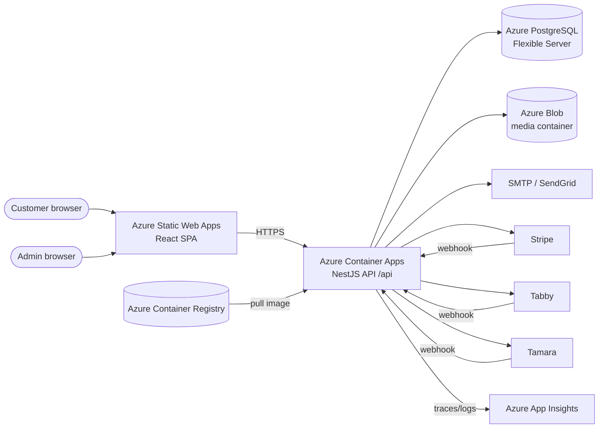
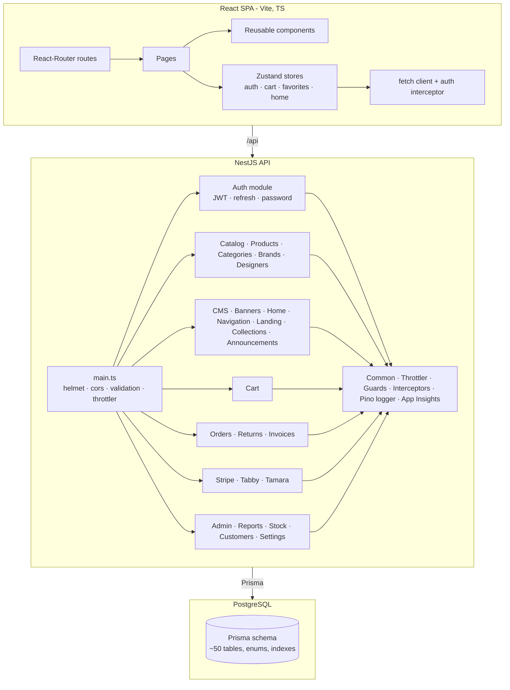
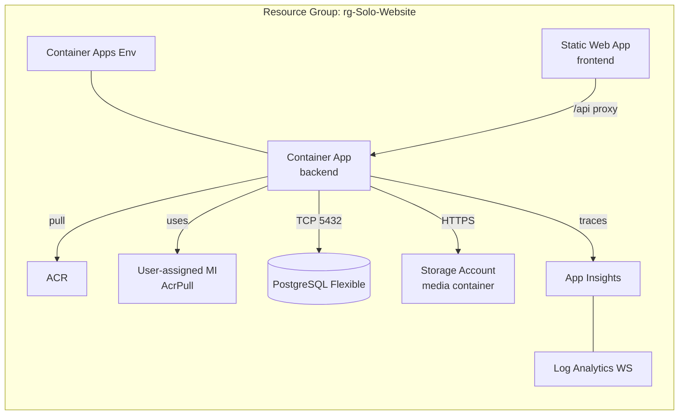
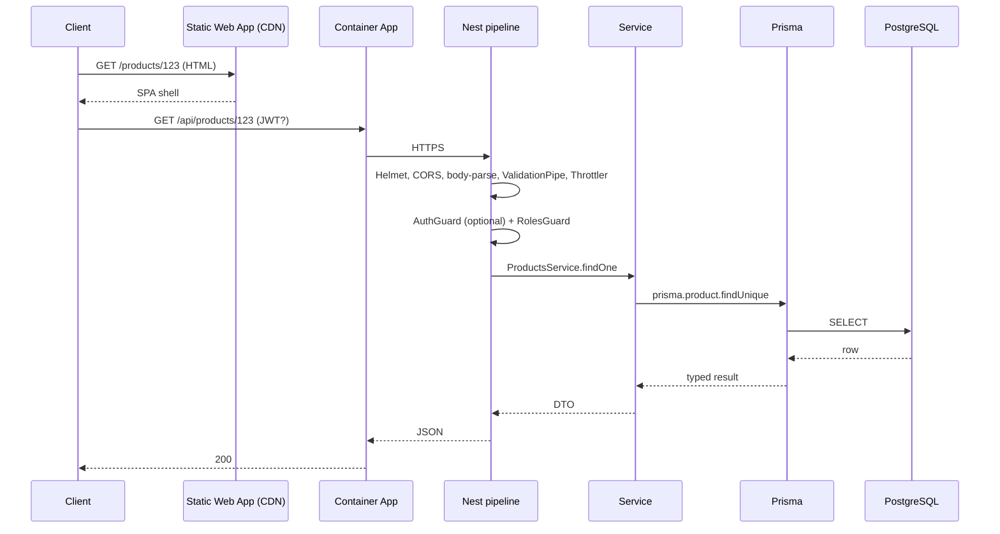

# 03 — High-Level Design (HLD)

## 1. System context



## 2. Component view



## 3. Tech stack summary

| Layer | Choice | Rationale |
|---|---|---|
| Frontend framework | React 19 + Vite 6 + TS 5 | Fast HMR, modern SSG-ready, small bundles |
| State | Zustand 5 | Tiny, ergonomic, no boilerplate |
| Routing | react-router-dom 7 | Standard SPA routing, lazy loading |
| Styling | CSS modules + design tokens | Predictable, no CSS-in-JS overhead |
| Backend framework | NestJS 10 | DI + module boundaries + good test ergonomics |
| ORM | Prisma 5 | Type-safe DB layer, migrations |
| DB | PostgreSQL 14 | Mature, JSON support, full-text search ready |
| Auth | Passport-JWT + Argon2id | Industry-standard hashing, stateless tokens |
| Validation | class-validator + Joi (env) | DTO-level + boot-time validation |
| Logging | nestjs-pino | Structured JSON logs, fast |
| Telemetry | Application Insights SDK | Native Azure observability |
| Caching | @nestjs/cache-manager | Optional in-memory cache for hot reads |
| Throttling | @nestjs/throttler | Per-route rate limits |
| Files / images | sharp + Azure Blob | On-the-fly resize, durable storage |
| PDF | pdfkit | Invoice rendering |
| Email | nodemailer | Transactional email via SMTP |
| Payments | Stripe SDK + custom Tabby/Tamara | UAE-friendly mix |

## 4. Deployment topology (Azure)



Provisioned by [infra/main.bicep](../infra/main.bicep) and orchestrated by
`azd up` / `azd deploy`. See [09 Deployment & Operations](./09-deployment-and-operations.md)
for the runbook.

## 5. Request lifecycle



## 6. Cross-cutting concerns

| Concern | Implementation |
|---|---|
| Authentication | `JwtAuthGuard` (Passport-JWT). Tokens signed HS256, 15-min access TTL, refresh tokens persisted & rotated |
| Authorisation | `RolesGuard` reads `@Roles(...)` decorator metadata; enum `UserRole` |
| Validation | Global `ValidationPipe({ whitelist: true, transform: true })` |
| Errors | Global `HttpExceptionFilter` returns `{ statusCode, message, error, timestamp, path }` |
| Logging | nestjs-pino HTTP middleware + child loggers per service |
| Tracing | `tracing.ts` boots Application Insights before Nest |
| Rate limiting | Global `ThrottlerGuard`; `/auth/*` overridden to 5 / 15 min |
| Security headers | Helmet defaults |
| CORS | Allowlist of SWA origins from `CORS_ORIGINS` env |
| Caching | Per-controller `CacheInterceptor` on hot read paths |
| Soft delete | `deletedAt` filters in product queries |
| Idempotency | `stripe_events.id` unique-key dedup; refresh token rotation |
| Migrations | Prisma migrations in `backend/prisma/migrations` |

## 7. Data flow — checkout (PAID happy path)

```mermaid
sequenceDiagram
  participant SPA
  participant API
  participant DB
  participant Stripe
  SPA->>API: POST /api/orders {addressId, shippingMethod, paymentMethod, items, promoCode?, loyaltyAed?}
  API->>DB: BEGIN; lock product rows; compute totals; create Order(PAYMENT_PENDING); create OrderItems; reserve stock
  DB-->>API: orderId
  API-->>SPA: {orderId, total}
  SPA->>API: POST /api/stripe/create-payment-intent {orderId}
  API->>Stripe: PaymentIntent.create(amount, currency=AED, metadata={orderId})
  Stripe-->>API: {clientSecret, id}
  API-->>SPA: {clientSecret}
  SPA->>Stripe: confirmCardPayment(clientSecret)
  Stripe-->>SPA: succeeded
  Stripe->>API: POST /api/stripe/webhook (signed)
  API->>DB: UPSERT stripe_events; if new => order.status=PAID, decrement stock, write status_history, issue invoice, post loyalty earn
  API-->>Stripe: 200
  SPA->>API: GET /api/orders/:id (poll until PAID)
```

## 8. Scalability strategy

- ACA replicas: scale by HTTP concurrency (default min 1, max 10).
- Postgres: vertical scale (Flexible Server SKU); read replicas planned.
- Cache hot category/brand/home reads in-memory (process-level) with short
  TTLs; future: Redis cache when multi-replica.
- Static assets (images) served from Blob via SWA-managed routes; can be
  fronted by Azure CDN/Front Door.

## 9. Failure modes & resilience

| Scenario | Mitigation |
|---|---|
| DB connection blip | Prisma reconnect; opossum circuit breaker around 3rd-party calls |
| Stripe webhook lost | Stripe auto-retries with exp backoff; idempotent on our side |
| Out-of-stock race | Decrement inside a transaction; return 409 if reservation fails |
| Bad JWT / expired | 401 with hint to refresh; refresh endpoint returns new pair |
| Image upload failure | Multipart upload returns 4xx; UI surfaces the error |
| Email outage | Nodemailer retries; non-fatal — DB state remains consistent |

## 10. Future evolution

- Read replicas for catalog
- Redis cache for cart sessions and rate-limit counters
- Multi-currency display
- AR locale UI
- Native mobile app reusing the same `/api`
- ETL → BI pipeline (Azure Synapse / Fabric)
