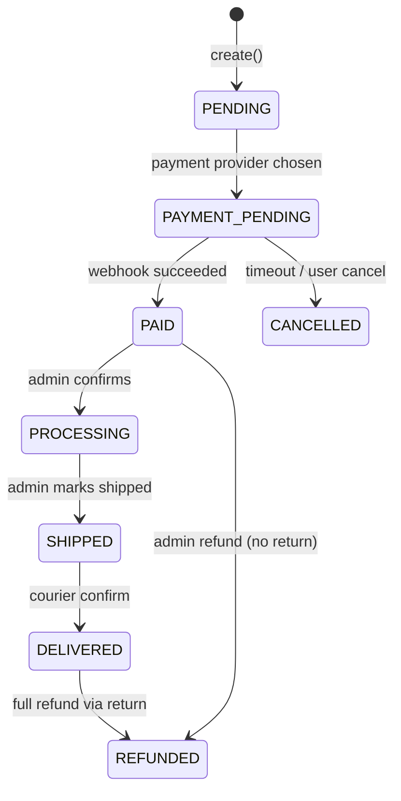
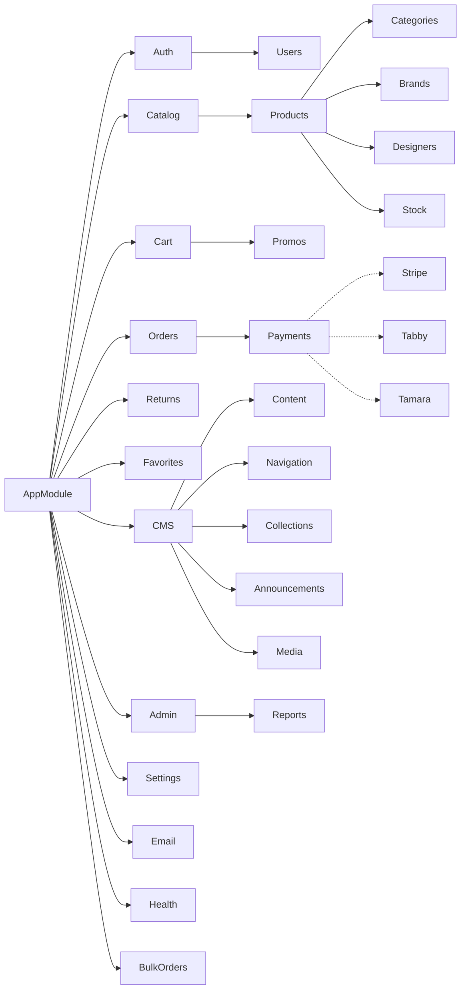

# 04 — Low-Level Design (LLD)

This document drills into each backend module: responsibility, key
controllers, services, DTOs, and notable rules. Pair it with [06 API
Reference](./06-api-reference.md) for endpoint catalogues and
[05 Database & ER Diagram](./05-database-er-diagram.md) for schema.

> **Layout:** `backend/src/<module>/{controller,service,module}.ts` + `dto/`.
> Modules are imported in [`backend/src/app.module.ts`](../backend/src/app.module.ts).

## 1. App bootstrap (`main.ts`)

Boot order:

1. `tracing.ts` initialises Application Insights **before** any Nest code.
2. `NestFactory.create(AppModule, { bufferLogs: true })`.
3. Pino logger attached.
4. `app.setGlobalPrefix('api')` — every route is `/api/...`.
5. `app.useGlobalPipes(new ValidationPipe({ whitelist: true, transform: true, forbidNonWhitelisted: true }))`.
6. `app.useGlobalFilters(new HttpExceptionFilter())`.
7. Helmet, CORS (allowlist), compression.
8. Swagger UI at `/api/docs` (production-gated by `SWAGGER_ENABLED`).
9. `app.listen(PORT)`.

## 2. `AuthModule`

**Responsibility:** registration, login, password reset, email verification,
refresh-token rotation.

| Endpoint | Notes |
|---|---|
| `POST /api/auth/register` | Argon2id hash; emits verification token email |
| `POST /api/auth/login` | Returns `{ user, tokens: { accessToken, refreshToken } }` |
| `POST /api/auth/refresh` | Rotates refresh token; revokes old |
| `POST /api/auth/logout` | Revokes a single refresh token |
| `POST /api/auth/forgot-password` | Issues `password_reset_tokens` row |
| `POST /api/auth/reset-password` | Consumes token, sets new hash |
| `POST /api/auth/verify-email` | Consumes `email_verification_tokens` row |
| `GET /api/auth/me` | Current user from JWT |

Throttle: hard-limited to **5 requests / 15 min / IP** on the entire
`/auth/*` namespace via a route-scoped Throttler override.

Token spec:

- Access JWT — HS256, payload `{ sub: userId, role, email }`, TTL 15 min.
- Refresh — opaque random string stored hashed in `refresh_tokens` with
  `expiresAt`, `revokedAt`, `replacedByTokenId`. Detect reuse → revoke
  whole chain.

## 3. `UsersModule` (account)

Routes under `/api/account/*`:

- `GET /me`, `PATCH /me`, `DELETE /me` (soft delete)
- Addresses: list / create / update / delete / set-default
- Saved cards: CRUD on `saved_payment_methods`
- Loyalty: `GET /loyalty/wallet`, `GET /loyalty/transactions`

Service enforces `userId` ownership on every mutation.

## 4. `CatalogModule` & `ProductsModule`

`CatalogController` exposes denormalised read endpoints used by listing
pages. `ProductsService` is the canonical CRUD surface.

Key behaviours:

- Soft-delete: every list query adds `where: { deletedAt: null }`.
- Variant resolution: `findOne` includes `productGroup → products` for
  sibling variants and synthesises the variant axes the UI needs.
- Pricing: joined `product_pricing` row; sale logic chooses minimum of
  `salePrice` (not yet a column) and `price_incl_vat_aed` if a discount
  applies.
- Listing accepts `q`, `categoryId`, `brandId`, `designerId`, `priceMin`,
  `priceMax`, `inStock`, `onSale`, `isNew`, `isFeatured`, `isBestSeller`,
  `sort`, `page`, `pageSize`.
- Caching: 60 s in-memory cache on category, brand, designer indices.

## 5. `CategoriesModule`, `BrandsModule`

CRUD plus `slug → entity` lookups, plus subcategories under `categories`.
Public reads + admin writes (gated by `RolesGuard(ADMIN, SUPER_ADMIN)`).

## 6. `CartModule`

Stateful cart per user (or guest cookie):

- `GET /api/cart` — returns active cart, computed totals.
- `POST /api/cart/items` — `{ type=PRODUCT, itemId, quantity }`.
- `PATCH /api/cart/items/:id` — quantity.
- `DELETE /api/cart/items/:id`.
- `DELETE /api/cart` — clear.
- `POST /api/cart/promo` / `DELETE /api/cart/promo` — apply/remove promo.
- `POST /api/cart/loyalty` / `DELETE /api/cart/loyalty` — set redemption.

Computation runs **server-side** every read; never trust client subtotals.

## 7. `OrdersModule`

Lifecycle:



Snapshot fields written at creation: `subtotalExclVat`, `vatAmount`,
`vatRateSnapshot`, `shippingExclVat`, `shippingVat`, `discountExclVat`,
`loyaltyRedeemAed`, `loyaltyEarnAed`, `totalInclVat`. Each line stores
its own VAT split.

Stock logic: at order create, reserve `quantity` (`reservedQty++`); at
PAID, commit the decrement (`stockQty--`, `reservedQty--`) and write a
`stock_movements` row of type `OUT`. On cancel/expire, release reservation.

Status changes always insert into `order_status_history`.

## 8. `ReturnsModule`

- Customer endpoints under `/api/returns` (request, list mine, cancel
  while still `REQUESTED`).
- Admin endpoints under `/api/admin/returns` (approve, reject, mark
  received, complete with refund method, list with filters).
- Completing a return:
  1. Restores stock per item (`StockMovementType.IN`).
  2. Refunds via `RefundMethod` — `ORIGINAL_PAYMENT` triggers Stripe
     refund call; `LOYALTY_AED` posts a `LoyaltyTransaction.EARNED` of
     amount; `STORE_CREDIT` is reserved for future.
  3. If the refund equals the order total, order goes to `REFUNDED`.

## 9. `StripeModule` (and Tabby/Tamara)

Module exposes:

- `POST /api/stripe/create-payment-intent` — body `{ orderId }`.
- `POST /api/stripe/webhook` — signed payload; verifies with
  `STRIPE_WEBHOOK_SECRET`; idempotent via `stripe_events`.

Order PAID transition is performed inside the webhook handler in a single
DB transaction so the order, status history, stock movement, invoice and
loyalty earn either all happen or none do.

Tabby & Tamara mirror the same pattern with their own session/webhook
endpoints. (Implementation details live in their respective module
folders; see [06 API Reference](./06-api-reference.md).)

## 10. `FavoritesModule`

- `GET /api/favorites` — list mine.
- `POST /api/favorites` `{ productId }` — idempotent insert.
- `DELETE /api/favorites/:productId` — remove.

Auth required; product must be active and not soft-deleted.

## 11. `PromosModule`

CRUD on `promo_codes`. Validation engine checks: active flag, expiry
window, usage caps (`maxUses`, `maxUsesPerUser`), and minimum order
amount. Redemption increments `usedCount` atomically.

## 12. `BulkOrdersModule`

Public `POST /api/bulk-orders` accepts the RFQ form. Admin queue at
`/api/admin/bulk-orders` lets staff page, filter and update status
(`NEW → CONTACTED → QUOTED → CONVERTED → CLOSED`).

## 13. CMS modules (`Cms`, `Banners` (under content), `Navigation`,
`Collections`, `Announcements`)

- `ContentController` (`/api/content`) — exposes the assembled home page,
  category landing config, single banner placements, navigation tree, and
  active announcements in shapes optimised for the storefront.
- Admin endpoints under `/api/admin/...` perform CRUD on the underlying
  tables.
- Banners reference `media_assets` (desktop + mobile) and have schedules.
- Home page is described by `home_page_config` + ordered
  `home_page_sections`; each section has a `type` and a `config` JSON
  (e.g., `COLLECTION` references a `product_collections` slug).
- Navigation is a tree (`navigation_menu_items.parentId`).
- Announcements optionally link to a `promo_codes` row.

## 14. `MediaModule`

- `POST /api/media/upload` — admin-only multipart upload; pipes through
  sharp to generate `original`, `thumb`, `medium`, `large` variants
  stored in Blob; row inserted into `media_assets`.
- `GET /api/media/:id` and `DELETE /api/media/:id` (soft delete via
  `isDeleted=true`).
- Returns CDN-friendly URLs (Blob path or SWA-proxied path).

## 15. `StockModule` (admin)

- `GET /api/admin/stock/movements` — paged ledger.
- `POST /api/admin/stock/adjust` — `{ productId, quantity, type, notes }`.
- `GET /api/admin/stock/low` — products under `lowStockAlert`.

## 16. `AdminModule` & `ReportsController`

- `/api/admin/customers` — list / detail / soft delete (deletes refresh
  tokens, addresses, etc., before user). **Used by the smoke-test cleanup
  script.**
- `/api/admin/reports/*` — sales summary, revenue by period, top products,
  customer LTV, order status breakdown.

## 17. `SettingsModule`

Generic key/value store at `/api/settings/:group/:key` with admin write
endpoints. Preloaded groups: `vat`, `shipping`, `loyalty`, `general`.

## 18. `EmailModule`

Wraps nodemailer with templated transactional emails:

- Welcome / verification
- Password reset
- Order confirmation (PDF invoice attached)
- Order shipped / delivered
- Return status updates
- Bulk-order RFQ confirmation

## 19. `HealthModule`

`/api/health` and `/api/health/ready` powered by `@nestjs/terminus`,
checks: process uptime, Prisma connectivity, Blob reachability (HEAD on
container).

## 20. `Common` cross-cutting

Located in `backend/src/common`:

- `JwtAuthGuard`, `OptionalJwtAuthGuard` — Passport-JWT wrappers.
- `RolesGuard` + `@Roles()` decorator — RBAC.
- `HttpExceptionFilter` — uniform error envelope.
- `LoggingInterceptor` — request/response timing logs.
- `TransformInterceptor` — wraps responses where applicable.
- DTO base classes for pagination & sort.

## 21. Error contract

```json
{
  "statusCode": 422,
  "error": "Unprocessable Entity",
  "message": ["price must be a positive number"],
  "timestamp": "2026-05-12T10:11:12.345Z",
  "path": "/api/admin/products"
}
```

## 22. Module dependency graph


