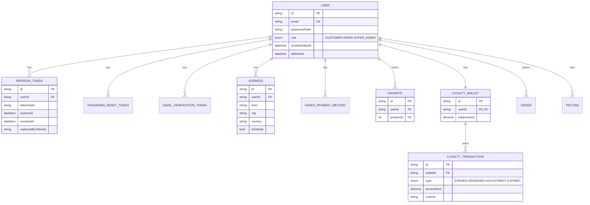
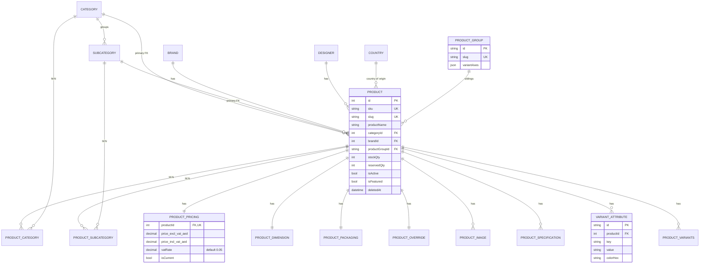
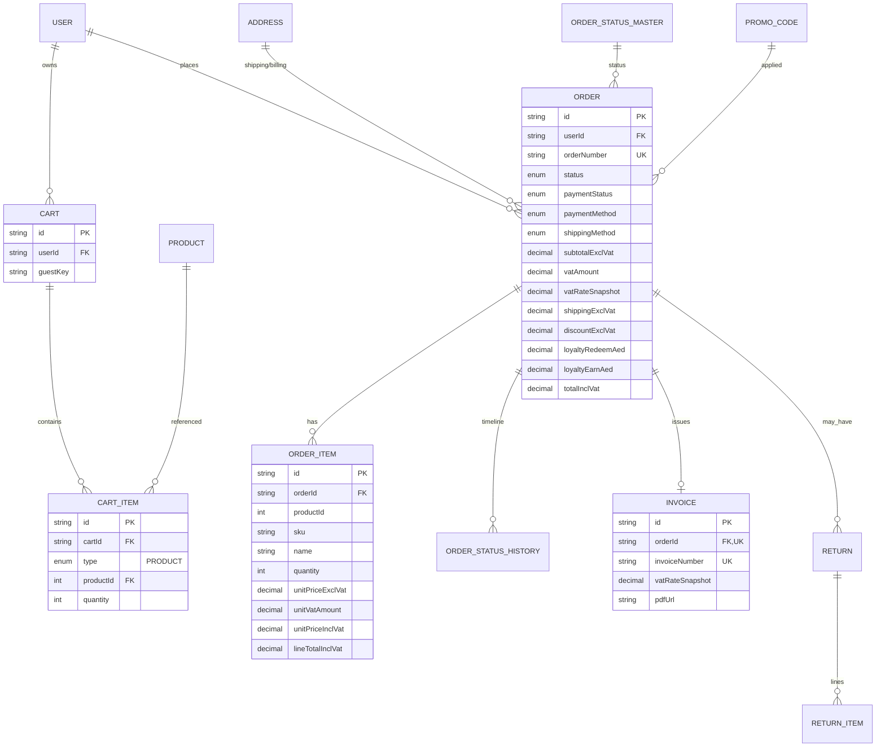
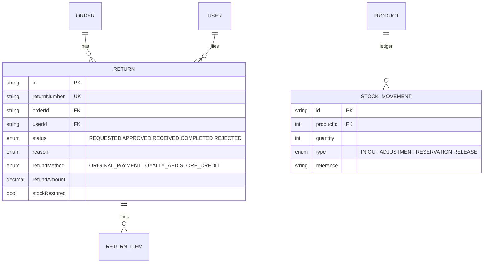
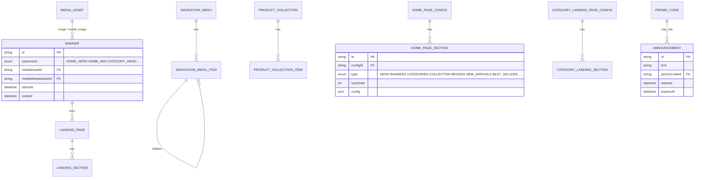
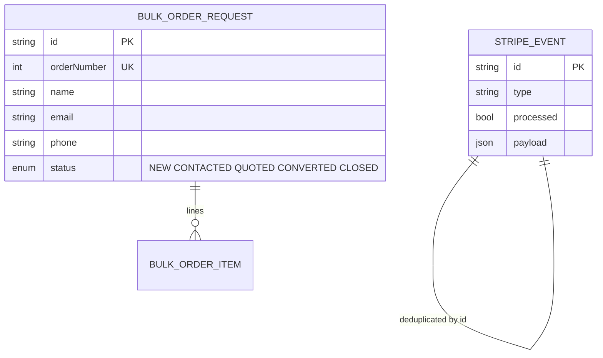
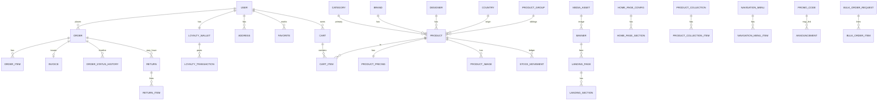

# 05 — Database & ER Diagram

The canonical schema is [`backend/prisma/schema.prisma`](../backend/prisma/schema.prisma)
(~1180 lines). Migrations live in `backend/prisma/migrations`. PostgreSQL
14 on Azure Flexible Server.

> **Reading guide.** The full ER diagram below is split by domain so it
> stays legible. A consolidated diagram follows.

## 1. Domains overview

| Domain | Tables (logical names) |
|---|---|
| Identity | `users`, `refresh_tokens`, `password_reset_tokens`, `email_verification_tokens` |
| Customer data | `addresses`, `saved_payment_methods`, `favorites` |
| Loyalty | `loyalty_wallets`, `loyalty_transactions`, `loyalty_page_config` |
| Catalog core | `products`, `categories`, `subcategories`, `brands`, `designers`, `countries` |
| Catalog M:N | `product_categories`, `product_subcategories` |
| Catalog enrichment | `product_pricing`, `product_dimensions`, `product_packaging`, `product_images`, `product_specifications`, `product_overrides` |
| Variants | `product_groups`, `variant_attributes`, `product_variants` |
| Cart | `carts`, `cart_items` |
| Orders | `orders`, `order_items`, `order_status_history`, `order_status_master`, `invoices` |
| Returns | `returns`, `return_items` |
| Stock | `stock_movements` |
| Marketing | `promo_codes`, `announcements` |
| CMS storefront | `banners`, `landing_pages`, `landing_sections`, `navigation_menus`, `navigation_menu_items`, `product_collections`, `product_collection_items`, `home_page_config`, `home_page_sections`, `category_landing_page_config`, `category_landing_sections`, `site_settings` |
| Media | `media_assets` |
| B2B | `bulk_order_requests`, `bulk_order_items` |
| Webhooks | `stripe_events` |

## 2. Identity & customer

## 3. Catalog

## 4. Cart & orders

## 5. Returns & stock

## 6. CMS / storefront

## 7. B2B & integrations

## 8. Consolidated ER diagram

## 9. Enums (selected)

| Enum | Values |
|---|---|
| `UserRole` | `CUSTOMER`, `ADMIN`, `SUPER_ADMIN` |
| `OrderStatus` | `PENDING`, `PAYMENT_PENDING`, `PAID`, `PROCESSING`, `SHIPPED`, `DELIVERED`, `CANCELLED`, `REFUNDED` |
| `PaymentStatus` | `PENDING`, `AUTHORIZED`, `PAID`, `FAILED`, `REFUNDED` |
| `PaymentMethod` | `CREDIT_CARD`, `CASH_ON_DELIVERY`, `TABBY`, `TAMARA` |
| `ShippingMethod` | `STANDARD`, `EXPRESS` |
| `LoyaltyTransactionType` | `EARNED`, `REDEEMED`, `ADJUSTMENT`, `EXPIRED` |
| `CartItemType` | `PRODUCT` |
| `ReturnStatus` | `REQUESTED`, `APPROVED`, `RECEIVED`, `COMPLETED`, `REJECTED` |
| `ReturnReason` | `DEFECTIVE`, `WRONG_ITEM`, `NOT_AS_DESCRIBED`, `CHANGE_OF_MIND`, `OTHER` |
| `RefundMethod` | `ORIGINAL_PAYMENT`, `LOYALTY_AED`, `STORE_CREDIT` |
| `StockMovementType` | `IN`, `OUT`, `ADJUSTMENT`, `RESERVATION`, `RELEASE` |
| `BannerPlacement` | `HOME_HERO`, `HOME_MID`, `CATEGORY_HERO`, `PRODUCT_BANNER`, … |
| `HomeSectionType` | `HERO`, `BANNERS`, `CATEGORIES`, `COLLECTION`, `BRANDS`, `NEW_ARRIVALS`, `BEST_SELLERS`, `FEATURED`, `ANNOUNCEMENT` |
| `LandingSectionType` | `HERO`, `IMAGE_TEXT`, `PRODUCT_GRID`, `BANNER`, `RICH_TEXT`, `VIDEO`, `COLLECTION` |
| `CategoryLandingSectionType` | `HERO`, `SUBCATEGORIES`, `BANNER`, `PRODUCT_GRID`, `RICH_TEXT` |
| `ProductCollectionStrategy` | `MANUAL`, `AUTO` |
| `BulkOrderStatus` | `NEW`, `CONTACTED`, `QUOTED`, `CONVERTED`, `CLOSED` |
| `PromoType` | `PERCENT`, `FIXED`, `FREE_SHIPPING` |

## 10. Indexing summary (high-traffic)

| Table | Index | Purpose |
|---|---|---|
| `products` | `slug`, `sku`, `categoryId`, `brandId`, `isFeatured`, `isActive`, `deletedAt`, `productGroupId`, `createdAt` | Listing/sort |
| `product_pricing` | `productId` | Join performance |
| `orders` | `userId`, `status`, `paymentStatus`, `createdAt`, `orderNumber` UK | Queue & history |
| `order_items` | `orderId`, `productId` | Reports |
| `cart_items` | `cartId`, `productId` | Cart read |
| `refresh_tokens` | `userId`, `tokenHash` UK, `expiresAt` | Auth |
| `stripe_events` | `processed,createdAt` | Reconciliation |
| `stock_movements` | `productId`, `type`, `createdAt` | Ledger |
| `announcements` | `isActive`, `startsAt`, `expiresAt`, `sortOrder` | Storefront |
| `media_assets` | `folder`, `ownerType,ownerId`, `isDeleted` | Library |

## 11. Migrations & seeding

- Generate Prisma client: `npm run prisma:generate`
- Apply migrations (dev): `npm run prisma:migrate`
- Apply migrations (prod): `prisma migrate deploy`
- Seed: `npm run db:seed` → `prisma/seed.ts`
- Backups: workspace `backups/` plus
  `solo_ecommerce_pre_cleanup_20260208.dump` (pre-cleanup snapshot).
- Azure Postgres Flexible Server has automated daily backups (7-day
  retention by default; tune in [infra/main.bicep](../infra/main.bicep)).
