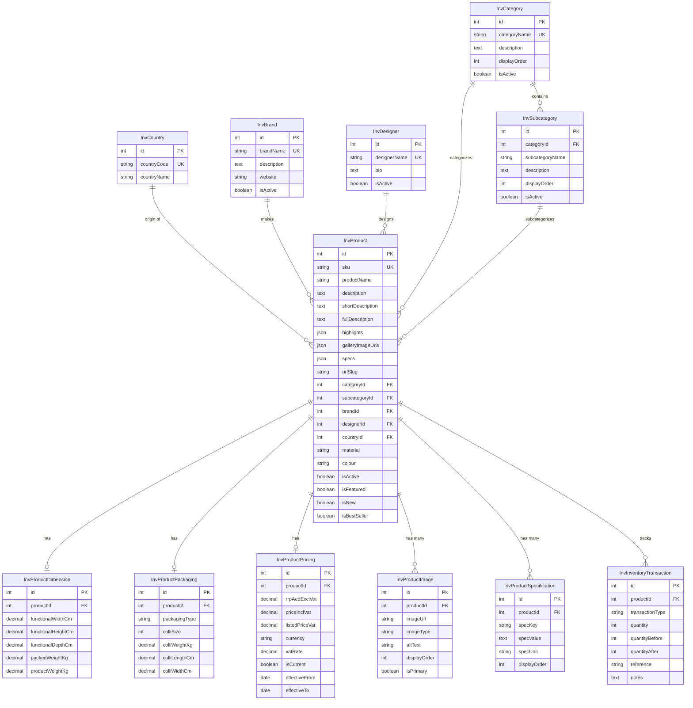

# Solo E-Commerce - Database ER Diagram

This document provides a visual representation of the database schema using Mermaid diagrams.

## Complete ER Diagram

```mermaid
erDiagram
    %% ===== PUBLIC SCHEMA - USER & AUTH =====
    
    User ||--o{ Address : "has many"
    User ||--o| Cart : "has one"
    User ||--o{ Order : "has many"
    User ||--o{ RefreshToken : "has many"
    User ||--o| LoyaltyWallet : "has one"
    User ||--o{ SavedPaymentMethod : "has many"
    User ||--o{ AnalyticsEvent : "generates"
    
    User {
        uuid id PK
        string email UK
        string passwordHash
        string firstName
        string lastName
        string phone
        UserRole role
        boolean isActive
        boolean emailVerified
        datetime createdAt
        datetime updatedAt
    }
    
    RefreshToken {
        uuid id PK
        string token UK
        uuid userId FK
        datetime expiresAt
        boolean isRevoked
    }
    
    LoyaltyWallet ||--o{ LoyaltyTransaction : "has many"
    
    LoyaltyWallet {
        uuid id PK
        uuid userId FK
        decimal balanceAed
        decimal totalEarnedAed
        decimal totalRedeemedAed
    }
    
    LoyaltyTransaction {
        uuid id PK
        uuid walletId FK
        LoyaltyTransactionType type
        decimal amountAed
        string description
        uuid orderId
    }
    
    Address {
        uuid id PK
        uuid userId FK
        string label
        string firstName
        string lastName
        string addressLine1
        string city
        string postalCode
        boolean isDefault
    }
    
    SavedPaymentMethod {
        uuid id PK
        uuid userId FK
        string provider
        string brand
        string last4
        int expMonth
        int expYear
    }
    
    %% ===== PUBLIC SCHEMA - CATALOG =====
    
    Department ||--o{ Category : "contains"
    
    Department {
        uuid id PK
        string name UK
        string slug UK
        string description
        int sortOrder
        boolean isActive
    }
    
    Category ||--o{ Category : "parent-child"
    
    Category {
        uuid id PK
        uuid departmentId FK
        uuid parentId FK
        string name
        string slug UK
        string description
        string image
        int sortOrder
    }
    
    Brand {
        uuid id PK
        string name UK
        string slug UK
        string description
        string logo
        int sortOrder
    }
    
    ProductOverride {
        uuid id PK
        string inventorySku UK
        int inventoryId
        boolean isFeatured
        boolean isNew
        boolean isBestSeller
        decimal customPrice
        decimal customSalePrice
        string metaTitle
    }
    
    %% ===== PUBLIC SCHEMA - CART & ORDERS =====
    
    Cart ||--o{ CartItem : "contains"
    
    Cart {
        uuid id PK
        uuid userId FK
        datetime createdAt
    }
    
    CartItem {
        uuid id PK
        uuid cartId FK
        CartItemType type
        int productId
        uuid packageId FK
        int quantity
    }
    
    Order ||--o{ OrderItem : "contains"
    Order ||--o{ OrderStatusHistory : "has"
    Order }o--|| Address : "shipping"
    Order }o--|| Address : "billing"
    
    Order {
        uuid id PK
        string orderNumber UK
        uuid userId FK
        OrderStatus status
        PaymentStatus paymentStatus
        uuid shippingAddressId FK
        uuid billingAddressId FK
        ShippingMethod shippingMethod
        decimal subtotal
        decimal discount
        decimal tax
        decimal total
        string promoCode
        PaymentMethod paymentMethod
    }
    
    OrderItem {
        uuid id PK
        uuid orderId FK
        CartItemType type
        int productId
        string name
        string sku
        int quantity
        decimal price
        decimal subtotal
    }
    
    OrderStatusHistory {
        uuid id PK
        uuid orderId FK
        OrderStatus status
        string notes
        string createdBy
    }
    
    PromoCode {
        uuid id PK
        string code UK
        PromoType type
        decimal value
        decimal minOrderAmount
        int usageLimit
        int usageCount
        boolean isActive
        datetime startsAt
        datetime expiresAt
    }
    
    %% ===== PUBLIC SCHEMA - CMS =====
    
    Banner ||--o{ LandingPage : "hero for"
    
    Banner {
        uuid id PK
        BannerPlacement placement
        string title
        string subtitle
        string ctaText
        string ctaUrl
        string imageDesktopUrl
        int displayOrder
        boolean isActive
    }
    
    LandingPage ||--o{ LandingSection : "has"
    
    LandingPage {
        uuid id PK
        string slug UK
        string title
        uuid heroBannerId FK
        string seoTitle
        text seoDescription
        boolean isActive
    }
    
    LandingSection {
        uuid id PK
        uuid landingPageId FK
        LandingSectionType type
        string title
        text data
        text config
        int displayOrder
        boolean isActive
    }
    
    %% ===== PUBLIC SCHEMA - NAVIGATION =====
    
    NavigationMenu ||--o{ NavigationMenuItem : "contains"
    
    NavigationMenu {
        uuid id PK
        string key UK
        string name
        boolean isActive
    }
    
    NavigationMenuItem ||--o{ NavigationMenuItem : "children"
    
    NavigationMenuItem {
        uuid id PK
        uuid menuId FK
        uuid parentId FK
        string label
        string url
        string icon
        string badge
        int sortOrder
    }
    
    %% ===== PUBLIC SCHEMA - BLOG =====
    
    BlogCategory ||--o{ BlogPost : "contains"
    
    BlogCategory {
        uuid id PK
        string name UK
        string slug UK
        string description
        int sortOrder
    }
    
    BlogPost ||--o{ BlogPostTag : "has"
    BlogTag ||--o{ BlogPostTag : "tagged in"
    
    BlogPost {
        uuid id PK
        uuid categoryId FK
        string title
        string slug UK
        text excerpt
        text content
        string featuredImage
        string author
        boolean isFeatured
        boolean isActive
        datetime publishedAt
    }
    
    BlogTag {
        uuid id PK
        string name UK
        string slug UK
    }
    
    BlogPostTag {
        uuid id PK
        uuid postId FK
        uuid tagId FK
    }
    
    %% ===== PUBLIC SCHEMA - HOME CMS =====
    
    HomePageConfig ||--o{ HomePageSection : "has"
    
    HomePageConfig {
        cuid id PK
        string key UK
    }
    
    HomePageSection {
        cuid id PK
        string homePageId FK
        HomeSectionType type
        string title
        int position
        boolean isEnabled
        json config
    }
    
    CategoryLandingPageConfig ||--o{ CategoryLandingSection : "has"
    
    CategoryLandingPageConfig {
        cuid id PK
        string categoryId UK
        string heroTitle
        string heroImageUrl
        boolean isHeroEnabled
    }
    
    CategoryLandingSection {
        cuid id PK
        string landingId FK
        CategoryLandingSectionType type
        string title
        int position
        json config
    }
    
    %% ===== PUBLIC SCHEMA - ANALYTICS =====
    
    AnalyticsEvent {
        uuid id PK
        AnalyticsEventType type
        uuid userId FK
        int productId
        text metadata
        string sessionId
        datetime createdAt
    }
    
    SavedSearchTerm {
        uuid id PK
        string term
        int resultCount
        uuid userId
        string sessionId
    }
```



## Inventory Schema ER Diagram



## Relationship Summary

### Public Schema Relationships

| Parent | Child | Type | Description |
|--------|-------|------|-------------|
| User | Address | 1:N | User has many addresses |
| User | Cart | 1:1 | User has one cart |
| User | Order | 1:N | User has many orders |
| User | LoyaltyWallet | 1:1 | User has one wallet |
| User | RefreshToken | 1:N | User has many tokens |
| Department | Category | 1:N | Department has categories |
| Category | Category | 1:N | Self-referential hierarchy |
| Cart | CartItem | 1:N | Cart has many items |
| Order | OrderItem | 1:N | Order has many items |
| Order | Address | N:1 | Order has shipping/billing address |
| LandingPage | LandingSection | 1:N | Page has many sections |
| NavigationMenu | NavigationMenuItem | 1:N | Menu has many items |
| BlogCategory | BlogPost | 1:N | Category has many posts |
| BlogPost | BlogPostTag | 1:N | Post has many tags |

### Inventory Schema Relationships

| Parent | Child | Type | Description |
|--------|-------|------|-------------|
| InvCategory | InvSubcategory | 1:N | Category has subcategories |
| InvCategory | InvProduct | 1:N | Category has products |
| InvSubcategory | InvProduct | 1:N | Subcategory has products |
| InvBrand | InvProduct | 1:N | Brand has products |
| InvProduct | InvProductPricing | 1:1 | Product has pricing |
| InvProduct | InvProductDimension | 1:1 | Product has dimensions |
| InvProduct | InvProductImage | 1:N | Product has images |
| InvProduct | InvProductSpecification | 1:N | Product has specs |

### Cross-Schema References

The public schema references inventory schema products through:
- `CartItem.productId` → `InvProduct.id`
- `OrderItem.productId` → `InvProduct.id`
- `ProductOverride.inventoryId` → `InvProduct.id`
- `ProductOverride.inventorySku` → `InvProduct.sku`
- `AnalyticsEvent.productId` → `InvProduct.id`

These are **logical references** (not database foreign keys) handled in the application service layer.

## Enum Types

### Public Schema Enums

```sql
-- User Role
CREATE TYPE "UserRole" AS ENUM ('CUSTOMER', 'ADMIN', 'SUPER_ADMIN');

-- Order Status
CREATE TYPE "OrderStatus" AS ENUM (
  'PENDING', 'PAYMENT_PENDING', 'PAID', 'PROCESSING', 
  'SHIPPED', 'DELIVERED', 'CANCELLED', 'REFUNDED'
);

-- Payment Status
CREATE TYPE "PaymentStatus" AS ENUM (
  'PENDING', 'AUTHORIZED', 'PAID', 'FAILED', 'REFUNDED'
);

-- Payment Method
CREATE TYPE "PaymentMethod" AS ENUM ('CREDIT_CARD', 'CASH_ON_DELIVERY');

-- Shipping Method
CREATE TYPE "ShippingMethod" AS ENUM ('STANDARD', 'EXPRESS', 'OVERNIGHT', 'PICKUP');

-- Banner Placement
CREATE TYPE "BannerPlacement" AS ENUM (
  'HOME_HERO', 'HOME_MID', 'HOME_SECONDARY',
  'CATEGORY_TOP', 'CATEGORY_MID', 'CATEGORY',
  'PRODUCT_SIDEBAR', 'CHECKOUT_TOP', 'PROMOTION'
);

-- Landing Section Type
CREATE TYPE "LandingSectionType" AS ENUM (
  'PRODUCT_GRID', 'CATEGORY_GRID', 'RICH_TEXT', 'IMAGE',
  'BANNER_CAROUSEL', 'HERO', 'CATEGORY_TILES', 'PRODUCT_CAROUSEL',
  'BRAND_STRIP', 'PROMO_BANNER', 'HERO_SLIDER', 'VALUE_PROPS_ROW',
  'SALE_STRIP_BANNER', 'BLOG_LATEST_GRID', 'TESTIMONIALS', ...
);

-- Analytics Event Type
CREATE TYPE "AnalyticsEventType" AS ENUM (
  'PAGE_VIEW', 'PRODUCT_VIEW', 'PRODUCT_SEARCH',
  'ADD_TO_CART', 'REMOVE_FROM_CART', 'CART_VIEW',
  'CHECKOUT_START', 'CHECKOUT_COMPLETE', 'ORDER_PLACED'
);
```

## Model Statistics

| Category | Count |
|----------|-------|
| **Public Schema Models** | ~35 |
| **Inventory Schema Models** | ~10 |
| **Total Models** | ~45 |
| **Enum Types** | ~15 |
| **Foreign Key Relationships** | ~50 |
| **Unique Indexes** | ~30 |
